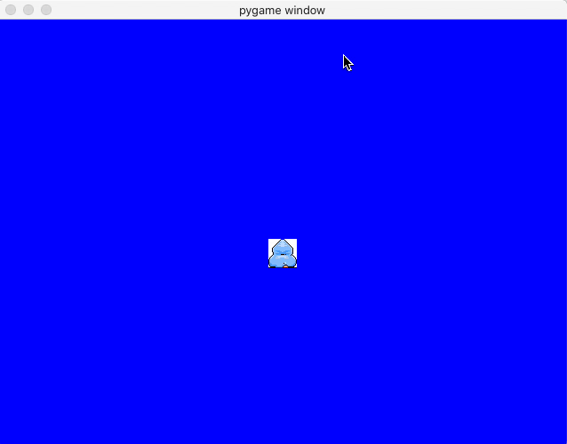

# pyweek29

My first entry for PyWeek

## Theme

The theme was "The butterfly effect". I had come up with an idea of building an adventure game called "Snack Quest".
The idea is that you're a young kid that woke up in the middle of the night hungry, and you're trying to get to the
kitchen to get snacks without waking anyone up. I was going to integrate the theme by having a house intercom system
in the hallway next to the parent's room that was on by default. Unless the player knew to turn of the intercom,
he would lose in the kitchen because eating the snack would be too loud to go unnoticed.

In the end I didn't have enough time to finish it, but is runnable in its current state. The WIP was to implement the
doors. Specifically the collision detection of the drawn door rectangle wasn't working, so the game never knew to
transition to the next room.

## Screenshots

After Getting player movement working:

After getting "boundaries" within the game window...
but had an unfortunate drawing issue:

## To Run

`pipenv install`

`python main.py`
